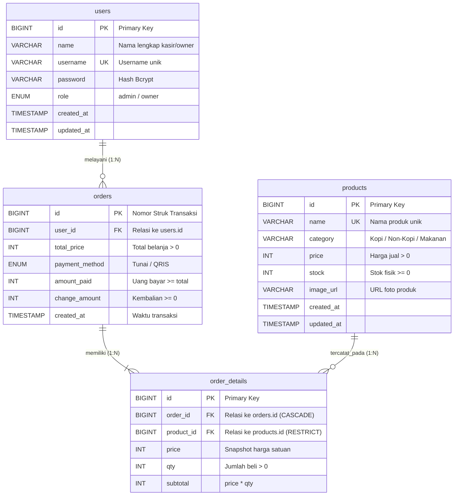

# POS Web Coffee Shop UMKM
### Aplikasi Kasir dan Manajemen Penjualan Berbasis Web (Ujian Praktik Kejuruan PPLG)

Aplikasi **POS (Point of Sale) Coffee Shop UMKM** adalah perangkat lunak kasir dan manajemen operasional kedai kopi yang dibangun menggunakan arsitektur web modern (*Full-Stack Web*). Aplikasi ini dirancang untuk memudahkan pencatatan transaksi penjualan, otomatisasi pemotongan stok bahan/minuman, serta penyajian laporan keuangan omset harian secara akurat dan *real-time*.

---

## 📌 Pembagian Hak Akses Pengguna (*Role*)

Sistem ini membedakan hak akses pengguna menjadi dua peran utama sesuai dengan Standar Operasional Prosedur (SOP) pada dunia usaha dan industri:

| Peran (*Role*) | Username | Password | Deskripsi Tugas & Wewenang |
| :--- | :--- | :--- | :--- |
| **Kasir** (`admin`) | `kasir` | `kasir123` | Bertugas di meja kasir: melayani pesanan pelanggan di Layar POS, menerima pembayaran (Tunai/QRIS), menghitung kembalian, mencetak struk transaksi, serta memperbarui jumlah stok fisik yang tersedia. |
| **Pemilik Usaha** (`owner`) | `owner` | `owner123` | Pemilik kedai kopi: memiliki wewenang penuh untuk menambah menu produk baru, mengatur harga jual, mengunggah foto menu, memantau laporan omset penjualan, dan melihat riwayat seluruh transaksi. |

---

## 🛠️ Teknologi yang Digunakan

Aplikasi ini dibangun menggunakan tumpukan teknologi (*technology stack*) standar industri:

1. **Sisi Belakang (*Back-End*)**:
   * **Node.js & Express.js**: Menyediakan layanan RESTful API yang cepat dan terstruktur.
   * **MySQL / MariaDB (XAMPP)**: Basis data relasional dengan mesin penyimpanan InnoDB untuk menjamin konsistensi data transaksi.
   * **JSON Web Token (JWT) & Bcrypt**: Mekanisme autentikasi login yang aman dan enkripsi kata sandi satu arah.
   * **Multer**: Penanganan berkas unggahan gambar produk ke server lokal.

2. **Sisi Depan (*Front-End*)**:
   * **Next.js (App Router) & React**: Antarmuka pengguna (*User Interface*) berbasis komponen yang dinamis dan interaktif.
   * **Vanilla CSS Modern**: Sistem tata letak responsif (*Responsive Design*) yang ringan, adaptif untuk layar laptop maupun telepon pintar (*smartphone* Android).
   * **Lucide React Icons**: Ikon visual yang informatif dan konsisten.

---

## 🗄️ Diagram Relasi Entitas (*Entity Relationship Diagram* / ERD)

Aplikasi memiliki **4 tabel berelasi** pada basis data MySQL:



---

## 📋 6 Kebutuhan Fungsional Utama (*Functional Requirements*)

| Kode | Kebutuhan Fungsional | Deskripsi Implementasi |
| :---: | :--- | :--- |
| **FR-01** | Autentikasi & Sesi Login | Login Kasir & Owner dengan enkripsi Bcrypt, token JWT, dan proteksi sesi peramban. |
| **FR-02** | Manajemen Menu & Foto Produk | CRUD produk (Kopi, Non-Kopi, Makanan), unggah foto ke server lokal, dan proteksi data transaksi. |
| **FR-03** | Pembatasan Hak Akses (*RBAC*) | Kasir hanya input transaksi & ubah stok; Owner berhak mengelola menu dan memantau keuangan. |
| **FR-04** | Layar Transaksi Kasir (*POS*) | Katalog produk 2 kolom, keranjang belanja, kalkulasi otomatis Tunai/QRIS, dan pemotongan stok atomik. |
| **FR-05** | Format & Cetak Struk Pembayaran | Tampilan nota standar kasir termal dengan tombol cetak peramban (`window.print()`). |
| **FR-06** | Riwayat Transaksi & Laporan Harian | Rekapitulasi penjualan per tanggal, filter metode bayar, omset hari ini, dan Top 5 produk terlaris. |

---

## 📁 Struktur Direktori Proyek

```text
Ujian PPLG/
├── backend/                       # Layanan Server REST API
│   ├── .env                       # Berkas konfigurasi koneksi MySQL dan JWT
│   ├── schema.sql                 # Skema DDL pembuatan tabel basis data
│   ├── public/uploads/            # Direktori penyimpanan foto produk lokal
│   ├── src/
│   │   ├── config/                # Konfigurasi koneksi basis data MySQL
│   │   ├── controllers/           # Logika pemrosesan bisnis (Auth, Produk, POS, Order, Laporan)
│   │   ├── middlewares/           # Verifikasi token JWT, pembatasan hak akses, dan upload file
│   │   ├── routes/                # Pemetaan rute URL API endpoint
│   │   ├── scripts/               # Skrip inisialisasi basis data (Migrate & Seeder)
│   │   └── server.js              # Titik masuk utama server Express
│   └── tests/                     # Skrip pengujian otomatis (Skenario BE-01 s.d. BE-11)
│
└── frontend/                      # Layanan Antarmuka Pengguna (Web Client)
    ├── .env.local                 # Konfigurasi URL server API backend
    ├── src/
    │   ├── app/                   # Rute halaman (Login, Dashboard, POS, Produk, Riwayat, Laporan)
    │   ├── components/            # Komponen modular (Sidebar, Navbar, Kartu Statistik, Modal)
    │   ├── context/               # AuthContext untuk manajemen sesi login di peramban
    │   └── lib/                   # Pustaka bantu (koneksi API fetch, format Rupiah, format tanggal)
    └── public/                    # Aset publik statis
```

---

## 🚀 Panduan Menjalankan Sistem (Langkah demi Langkah)

Ikuti langkah-langkah di bawah ini secara berurutan untuk menjalankan aplikasi pada komputer pengujian:

### Langkah 1: Persiapan Basis Data (XAMPP)
1. Buka aplikasi **XAMPP Control Panel**.
2. Pastikan modul **Apache** dan **MySQL** sudah dinyalakan (klik tombol **Start** hingga indikator berwarna hijau).
3. Secara bawaan, MySQL XAMPP berjalan pada *port* `3306` dengan pengguna `root` tanpa kata sandi.

### Langkah 2: Menyiapkan dan Menjalankan Server Backend
1. Buka terminal baru, lalu masuk ke direktori `backend`:
   ```bash
   cd backend
   ```
2. Pasang modul dependensi yang dibutuhkan:
   ```bash
   npm install
   ```
3. Lakukan inisialisasi basis data (membuat basis data `pos_coffee`, tabel-tabel relasi, serta mengisi data awal pengguna dan produk):
   ```bash
   npm run db:init
   ```
4. Jalankan server *backend*:
   ```bash
   npm run dev
   ```
   *Server backend akan aktif dan siap menerima permintaan di alamat: **`http://localhost:5000`**.*

### Langkah 3: Menyiapkan dan Menjalankan Antarmuka Frontend
1. Buka jendela terminal baru (terminal backend jangan ditutup), lalu masuk ke direktori `frontend`:
   ```bash
   cd frontend
   ```
2. Pasang dependensi antarmuka pengguna:
   ```bash
   npm install
   ```
3. Pastikan berkas `.env.local` telah mengarah ke server backend:
   ```env
   NEXT_PUBLIC_API_URL=http://localhost:5000
   ```
4. Jalankan server pengembang *frontend*:
   ```bash
   npm run dev
   ```
5. Buka peramban (*web browser*) seperti Google Chrome, lalu akses alamat:
   ```text
   http://localhost:3000
   ```

---

## 💡 Fitur-Fitur Unggulan

1. **Layar Transaksi Kasir (*Point of Sale*)**:
   * Tata letak dua kolom: katalog produk di sebelah kiri dan keranjang belanja interaktif di sebelah kanan.
   * Pencarian menu cepat dan penyaringan berdasarkan kategori (*Kopi*, *Non-Kopi*, *Makanan*).
   * Tombol pintas penambahan/pengurangan kuantitas pesanan yang secara otomatis mengunci apabila melebihi sisa stok fisik.
   * Penghitungan otomatis total belanja, uang pembayaran, dan kembalian secara tepat (*real-time*).
   * Transaksi atomik: pencatatan nota dan pemotongan stok dilakukan dalam satu siklus transaksi basis data (*database transaction*), mencegah stok minus.

2. **Manajemen Produk & Foto**:
   * Penambahan menu baru dengan unggahan foto langsung disimpan ke server lokal.
   * Fitur pembatasan wewenang: Kasir hanya berwenang memperbarui stok, sedangkan Pemilik (*Owner*) berwenang mengubah nama, kategori, harga, dan menghapus menu.
   * Proteksi integritas data: menu yang sudah pernah terjual tidak dapat dihapus sembarangan guna menjaga riwayat pembukuan.

3. **Riwayat Penjualan & Cetak Struk**:
   * Daftar seluruh nota transaksi dengan filter pencarian tanggal dan metode bayar (*Tunai* / *QRIS*).
   * Tampilan nota digital yang mendukung pencetakan struk fisik (*Print Receipt*) berstandar kertas kasir (*thermal paper*).

4. **Laporan & Dasbor Analisis Bisnis**:
   * Menampilkan ringkasan omset penjualan harian, jumlah nota transaksi, dan peringatan stok menipis (stok $\le$ 5).
   * Rekapitulasi perolehan dana per metode pembayaran serta daftar 5 produk terlaris (*Top 5 Best Seller*).

---

## 🧪 Pengujian Otomatis (*Unit & Scenario Testing*)

Untuk memastikan seluruh fungsi API bekerja sesuai standar uji kompetensi, pengujian otomatis dapat dijalankan dengan perintah berikut pada folder `backend`:
```bash
cd backend
npm test
```
*Seluruh skenario pengujian (`BE-01` sampai dengan `BE-11`) mencakup validasi login, penolakan input tidak valid, transaksi atomik, pencegahan manipulasi harga dari sisi client, hingga validasi hak akses bertingkat.*
