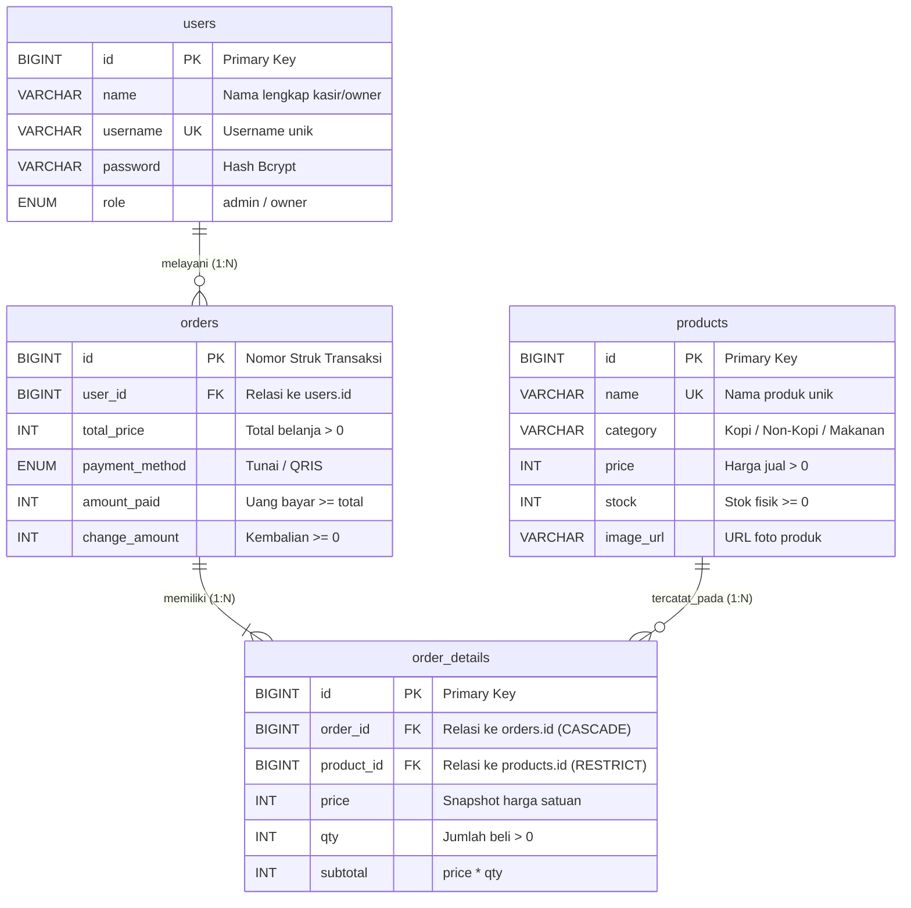

# Dokumentasi Teknis Sisi Belakang (Back-End)
### Layanan RESTful API POS Coffee Shop UMKM (Node.js & Express.js)

Dokumentasi ini disusun sebagai panduan teknis bagi siswa kejuruan (SMK Jurusan Pengembangan Perangkat Lunak dan Gim / Rekayasa Perangkat Lunak) untuk memahami arsitektur, basis data, dan antarmuka pemrograman aplikasi (*Application Programming Interface* / API) pada sistem kasir kedai kopi.

---

## 1. Konsep dan Tujuan Pengembangan

Bagian *Back-End* berfungsi sebagai pusat pemrosesan logika bisnis (*business logic*), pengamanan data, dan interaksi dengan basis data. Tujuan utama modul ini adalah:
1. **Otomatisasi Perhitungan Transaksi**: Mengkalkulasi subtotal pesanan, total belanja, dan uang kembalian secara terpusat di server untuk mencegah kecurangan atau kesalahan hitung kasir.
2. **Integritas dan Konsistensi Data Stok**: Menerapkan konsep **transaksi atomik** (*database transaction*) pada MySQL, sehingga saat pembayaran berhasil dicatat, jumlah stok bahan/produk langsung dipotong seketika tanpa risiko kegagalan separuh jalan (*data rollback*).
3. **Penyajian Laporan Usaha yang Transparan**: Menyediakan rekapitulasi data penjualan harian, omset kotor, serta perbandingan metode pembayaran Tunai dan QRIS secara *real-time*.

---

## 2. Struktur Basis Data Relasional (*Relational Database*)

Aplikasi menggunakan basis data **MySQL (InnoDB)** yang mendukung relasi antar-tabel serta integritas data (*Foreign Key Constraints*). Skema lengkap dapat dilihat pada berkas [`schema.sql`](./schema.sql).



### A. Tabel Pengguna (`users`)
Menyimpan kredensial autentikasi pengguna sistem (Kasir dan Pemilik).
| Nama Kolom (*Field*) | Tipe Data | Keterangan & Aturan |
| :--- | :--- | :--- |
| `id` | BIGINT UNSIGNED | Kunci Utama (*Primary Key*), bertambah otomatis (*Auto Increment*) |
| `name` | VARCHAR(100) | Nama lengkap pengguna (contoh: "Budi Kasir", "Ibu Sari") |
| `username` | VARCHAR(50) | Nama pengguna untuk proses login (bersifat unik / tidak boleh kembar) |
| `password` | VARCHAR(255) | Kata sandi yang telah dienkripsi menggunakan algoritma Bcrypt (10 *rounds*) |
| `role` | ENUM('admin','owner') | Peran hak akses: `admin` (Kasir) atau `owner` (Pemilik Usaha) |
| `created_at` | TIMESTAMP | Waktu saat akun pertama kali dibuat |
| `updated_at` | TIMESTAMP | Waktu saat data akun terakhir kali diperbarui |

### B. Tabel Produk Menu (`products`)
Menyimpan katalog minuman dan makanan yang dijual.
| Nama Kolom (*Field*) | Tipe Data | Keterangan & Aturan |
| :--- | :--- | :--- |
| `id` | BIGINT UNSIGNED | Kunci Utama (*Primary Key*), bertambah otomatis |
| `name` | VARCHAR(100) | Nama produk (bersifat unik, contoh: "Espresso", "Croissant") |
| `category` | VARCHAR(30) | Kategori menu: `'Kopi'`, `'Non-Kopi'`, atau `'Makanan'` |
| `price` | INT UNSIGNED | Harga jual dalam Rupiah (wajib berupa angka bernilai $\ge$ 1) |
| `stock` | INT UNSIGNED | Sisa persediaan stok fisik (nilai minimal 0, default 0) |
| `image_url` | VARCHAR(500) | Alamat berkas foto produk (disimpan di folder server `/uploads`) |
| `created_at` | TIMESTAMP | Waktu saat produk pertama kali didaftarkan |
| `updated_at` | TIMESTAMP | Waktu saat informasi produk terakhir kali diubah |

### C. Tabel Transaksi Penjualan (`orders`)
Menyimpan data ringkasan kepala nota transaksi (*invoice header*).
| Nama Kolom (*Field*) | Tipe Data | Keterangan & Aturan |
| :--- | :--- | :--- |
| `id` | BIGINT UNSIGNED | Kunci Utama (*Primary Key*), nomor struk unik transaksi |
| `user_id` | BIGINT UNSIGNED | Kunci Asing (*Foreign Key*) merujuk ke `users.id` (Kasir yang melayani) |
| `total_price` | INT UNSIGNED | Total tagihan belanja keseluruhan (Rupiah) |
| `payment_method` | ENUM('Tunai','QRIS') | Pilihan metode bayar yang sah |
| `amount_paid` | INT UNSIGNED | Jumlah uang yang diserahkan pelanggan (wajib $\ge$ total tagihan) |
| `change_amount` | INT UNSIGNED | Nilai kembalian yang harus dikembalikan kasir |
| `created_at` | TIMESTAMP | Waktu presisi saat transaksi dinyatakan selesai |

### D. Tabel Rincian Nota Penjualan (`order_details`)
Menyimpan butir item produk yang dibeli pada setiap nomor transaksi.
| Nama Kolom (*Field*) | Tipe Data | Keterangan & Aturan |
| :--- | :--- | :--- |
| `id` | BIGINT UNSIGNED | Kunci Utama (*Primary Key*), bertambah otomatis |
| `order_id` | BIGINT UNSIGNED | Kunci Asing merujuk ke nomor nota `orders.id` (*Cascade Delete*) |
| `product_id` | BIGINT UNSIGNED | Kunci Asing merujuk ke `products.id` (*Restrict Delete*) |
| `price` | INT UNSIGNED | Salinan harga satuan pada saat transaksi terjadi (*snapshot price*) |
| `qty` | INT UNSIGNED | Jumlah kuantitas porsi yang dibeli (minimal 1) |
| `subtotal` | INT UNSIGNED | Hasil perkalian antara harga satuan dan kuantitas (`price * qty`) |

---

## 3. Akun Uji Coba Bawaan (*Seeder*)

Saat perintah `npm run db:init` dieksekusi, sistem secara otomatis menyiapkan akun pengujian bawaan berikut:

| Akun Pengguna | Nama Lengkap | Username | Kata Sandi | Peran (*Role*) | Batasan Wewenang Bisnis |
| :--- | :--- | :--- | :--- | :--- | :--- |
| **Kasir** | Budi Kasir | `kasir` | `kasir123` | `admin` | Melayani transaksi kasir (POS), mengecek produk, memperbarui stok fisik, dan melihat riwayat nota. |
| **Owner** | Ibu Sari | `owner` | `owner123` | `owner` | Menambah menu baru, mengubah data & foto produk, menghapus menu, melihat dasbor omset, dan laporan harian. |

---

## 4. Panduan Menjalankan Layanan Backend

### A. Prasyarat Sistem
* **Node.js**: Versi LTS 18.x, 20.x, atau yang lebih baru.
* **XAMPP**: Modul MySQL diaktifkan melalui panel kontrol XAMPP.

### B. Konfigurasi Lingkungan Kerja (`.env`)
Berkas `.env` pada folder `backend/` telah disesuaikan dengan konfigurasi standar XAMPP:
```env
PORT=5000
NODE_ENV=development

# Konfigurasi Akses Database MySQL XAMPP
DB_HOST=127.0.0.1
DB_PORT=3306
DB_USER=root
DB_PASSWORD=
DB_NAME=pos_coffee

# Pengaturan Kunci Keamanan Token JWT
JWT_SECRET=super_secret_coffee_key_2026_change_in_production
JWT_EXPIRES_IN=1d
```

### C. Perintah Terminal
1. **Memasang Modul Dependensi**:
   ```bash
   npm install
   ```
2. **Inisialisasi Database Otomatis**:
   ```bash
   npm run db:init
   ```
   *Perintah ini menjalankan skrip migrasi tabel dan pengisian data uji coba (12 produk kafe lengkap dengan foto, 2 akun pengguna, serta 10 riwayat transaksi awal).*
3. **Menjalankan Server**:
   * Mode Pengembangan (*Auto-Reload* saat berkas disimpan):
     ```bash
     npm run dev
     ```
   * Mode Standar:
     ```bash
     npm start
     ```

---

## 5. Ringkasan Endpoint API (*REST API Documentation*)

Seluruh endpoint privat wajib menyertakan token autentikasi pada *HTTP Header*:
`Authorization: Bearer <token_jwt>`

### A. Layanan Autentikasi Pengguna
* `POST /login` (Publik): Melakukan verifikasi nama pengguna dan kata sandi, mengembalikan token JWT serta data profil pengguna.
* `POST /logout` (Privat): Mengakhiri sesi login pengguna.
* `GET /me` (Privat): Mengambil data profil pengguna yang sedang aktif berdasarkan token.

### B. Layanan Manajemen Produk
* `GET /products` (Kasir & Owner): Menampilkan daftar produk dengan fitur pencarian (`?q=`), kategori (`?category=`), dan status stok (`?stock=`).
* `GET /products/:id` (Kasir & Owner): Mengambil rincian spesifik satu produk beserta ringkasan performa penjualannya.
* `POST /products` (**Khusus Owner**): Menambahkan produk baru beserta unggahan file foto produk (*Multipart Form Data*).
* `PUT /products/:id` (Kasir & Owner):
  * **Kasir**: Hanya diizinkan mengubah nilai persediaan stok (`stock`).
  * **Owner**: Diizinkan mengubah nama, kategori, harga, stok, dan mengganti foto produk.
* `DELETE /products/:id` (**Khusus Owner**): Menghapus produk. Server akan otomatis menolak penghapusan apabila produk tersebut sudah pernah memiliki riwayat transaksi penjualan.

### C. Layanan Layar Kasir (*Point of Sale*)
* `GET /pos` (**Khusus Kasir**): Menampilkan katalog produk aktif yang siap ditransaksikan pada layar kasir.
* `POST /pos` (**Khusus Kasir**): Memproses transaksi pembayaran pelanggan, memotong sisa stok produk secara otomatis, dan menerbitkan nomor nota baru.

### D. Layanan Riwayat Transaksi & Laporan
* `GET /orders` (Kasir & Owner): Menampilkan daftar nota transaksi yang dapat disaring berdasarkan rentang tanggal (`?from=&to=`) dan metode bayar (`?payment=`).
* `GET /orders/:id` (Kasir & Owner): Mengambil rincian butir item pada satu nomor transaksi untuk keperluan pencetakan struk.
* `GET /dashboard` (Kasir & Owner): Mengambil data ringkasan omset hari ini, total nota, dan daftar produk yang stoknya menipis ($\le$ 5).
* `GET /reports/daily` (Kasir & Owner): Menyajikan rekapitulasi penjualan per tanggal (`?date=YYYY-MM-DD`), perolehan per metode bayar, dan 5 produk terlaris (*Top 5 Best Seller*).

---

## 6. Skenario Pengujian Otomatis (*Backend Test Scenarios*)

Server telah dilengkapi skrip pengujian fungsional otomatis yang dapat dijalankan melalui perintah:
```bash
npm test
```

Tabel skenario pengujian mengacu pada standar Ujian Kompetensi Keahlian (UKK):

| Kode | Nama Skenario | Langkah Pengujian | Kriteria Keberhasilan |
| :---: | :--- | :--- | :--- |
| **BE-01** | Login Kasir Valid | Kirim username `kasir` dan kata sandi benar | Status HTTP 200, mengembalikan token JWT yang sah. |
| **BE-02** | Login Tidak Valid | Kirim username atau kata sandi yang salah | Status HTTP 401 dengan pesan *"Username atau password salah."* |
| **BE-03** | Pencegahan Nama Produk Duplikat | Owner mendaftarkan produk dengan nama yang sudah ada | Status HTTP 422 dengan pesan *"Nama produk sudah terdaftar."* |
| **BE-04** | Validasi Harga & Stok Tidak Logis | Owner menginput harga bernilai minus atau format huruf | Status HTTP 422 dengan rincian pesan kesalahan validasi per *field*. |
| **BE-05** | Transaksi Tunai Sah | Pembelian produk dengan nominal pembayaran yang mencukupi | Status HTTP 201, kalkulasi kembalian tepat, stok produk berkurang. |
| **BE-06** | Pembayaran Tunai Kurang | Uang tunai yang diserahkan lebih kecil dari total belanja | Status HTTP 422, transaksi dibatalkan (*rollback*), stok tidak terpotong. |
| **BE-07** | Pembelian Melebihi Stok | Memesan kuantitas yang melampaui sisa stok di database | Status HTTP 422 dengan pesan stok tidak mencukupi, transaksi dibatalkan. |
| **BE-08** | Proteksi Manipulasi Harga Sisi Klien | Klien mencoba mengirimkan nilai harga murah secara manual | Status HTTP 201, server mengabaikan harga klien dan memakai harga sah database. |
| **BE-09** | Perlindungan Hapus Produk Terjual | Owner mencoba menghapus produk yang sudah ada di nota | Status HTTP 400, sistem menolak penghapusan demi menjaga riwayat pembukuan. |
| **BE-10** | Pembatasan Hak Akses (*Role Security*) | Pengguna mengakses endpoint yang bukan hak wewenangnya | Status HTTP 403 Forbidden (*Access Denied*). |
| **BE-11** | Akurasi Kalkulasi Omset Harian | Memeriksa kecocokan data omset pada laporan harian | Status HTTP 200, angka omset identik dengan total seluruh transaksi pada hari itu. |
